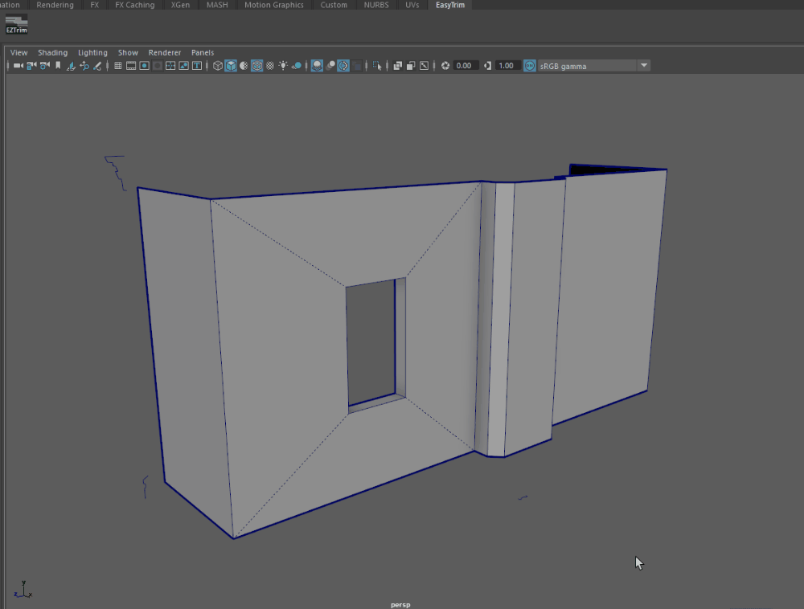

Creating trim detail in Maya typically involves extruding profile curves along a path, however there are so many steps involved that it made sense to wrap them all up in a script like this.

The basic idea is to select some continuous polygon edges for the path, then select an appropriate profile curve, and hit the EZtrim button to execute the entire process of extruding it along the path. The script essentially runs the steps I found myself doing manually all the time when creating trims for environments.

## Setup

Once you have copied this repository to your machine, drag the setup.py script into the viewport of a running instance of Maya. That should copy the script files to the appropriate Maya folders. There will be some output in the script editor so you can see what it's doing.

You should see a prompt to restart Maya, once you do that there will be a new shelf tab with an 'EZTrim' button in it.

If for some reason the above setup script does not work, you can manually copy the script files to the proper folders as follows:

copy file: ../EasyTrim/scripts/easyTrim.py to ../Documents/maya/2024/scripts
copy file: ../EasyTrim/icons/eZTrim.png to ../Documents/maya/2024/prefs/icons
copy file: ../EasyTrim/shelves/shelf_EasyTrim.mel to ../Documents/maya/2024/prefs/shelves
(this is exactly the same thing setup.py is doing)
